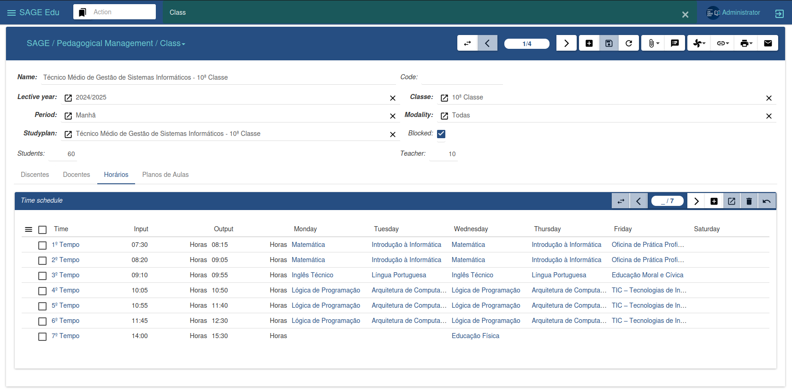
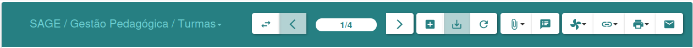
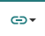
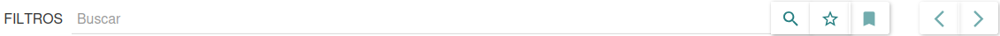

### Interface graphique

Nous allons maintenant décrire l'environnement de travail afin que l'utilisateur se familiarise avec l'interface et les composants de SAGE Education, et ainsi faciliter l'utilisation de la plateforme.

La figure ci-dessous illustre l'environnement de travail de SAGE Education, où la plupart des activités seront réalisées. Nous allons donc décrire les options offertes par cette interface.

- ***Menu latéral :*** La barre de menu située à gauche permet d'accéder aux fonctionnalités de chaque module. Elle propose différentes options selon les modules installés.

- ***Fenêtre centrale :*** La fenêtre centrale permet de basculer entre l'affichage de la liste et l'édition des données. Cette zone est responsable de cette action lors de l'enregistrement ou de la modification.

- ***Barre supérieure :*** En haut de l'interface se trouve la barre supérieure, qui regroupe toutes les fenêtres et tous les menus ouverts.

***Barre de gestion :*** La barre de gestion, ou barre d'options, offre diverses fonctionnalités. Elle permet de gérer tous les enregistrements, ainsi que d'en ajouter de nouveaux.

On y voit plusieurs boutons, chacun correspondant à une action donnant accès à une activité spécifique. Commençons par décrire la figure, de gauche à droite.

 ***Changer de Vue***

Il vous permet de modifier l'affichage des informations, en passant de la liste des enregistrements à l'édition des données, ou inversement.

 ***Retour/Suivant***

Il vous permet de naviguer vers un enregistrement précis, en avant ou en arrière, quelle que soit la vue active.

 ***Nouvel enregistrement***

Elle permet l'insertion de nouveaux enregistrements sur la plateforme.

 ***Enregistrer les modifications de l'enregistrement***

Et il vous permet d'enregistrer de nouveaux enregistrements, ainsi que les modifications apportées à un enregistrement spécifique.

 ***Annuler la modification***

Elle vous permet d'annuler les modifications apportées à un enregistrement avant son enregistrement, et vous permet également de mettre à jour un enregistrement donné ou la liste des enregistrements.

 ***Gérer les pièces jointes***

Permet de joindre des documents à une entité spécifique.

 ***Note*** 

Il permet à l'utilisateur ayant accès au système de laisser un message, une note ou des informations sur l'enregistrement sélectionné.

 ***Effectuer l'action***

Elle vous permet d'effectuer une action spécifique qui a été préalablement définie.

 ***Relier***

Il nous permet de visualiser les relations entre les différentes parties du système et l'enregistrement.

 ***Imprimante***

Il offre les mêmes fonctionnalités que le rapport, la seule différence étant qu'il ne génère pas de document numérique, mais imprime le document, créant ainsi un document physique.

 ***E-mail***

Cela nous permet d'envoyer un courriel à l'inscription sélectionnée.

 ***barre de recherche***

Cela nous permet de mener des recherches dans un domaine spécifique.
