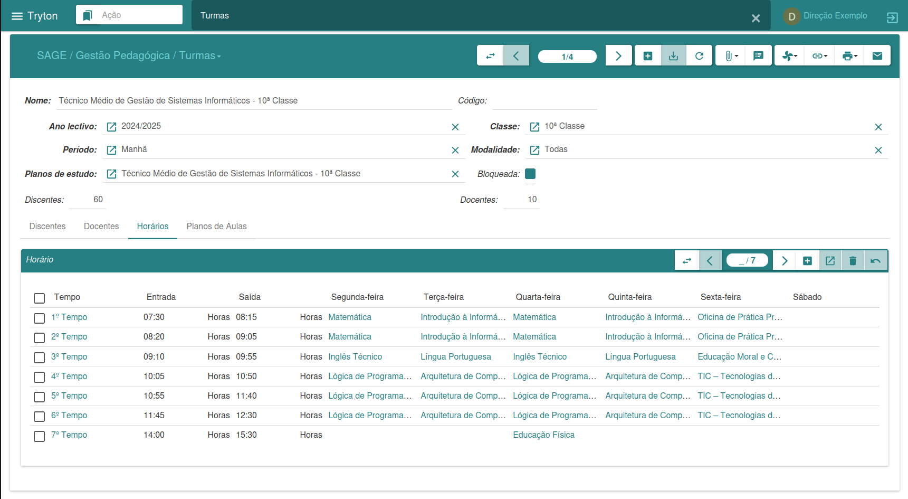
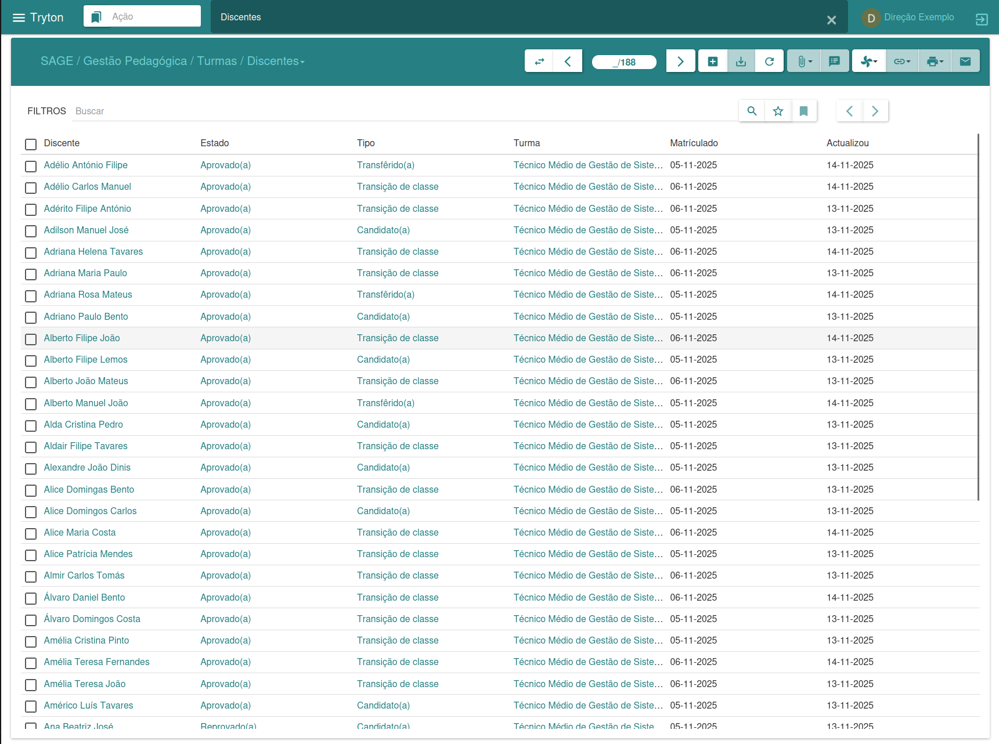
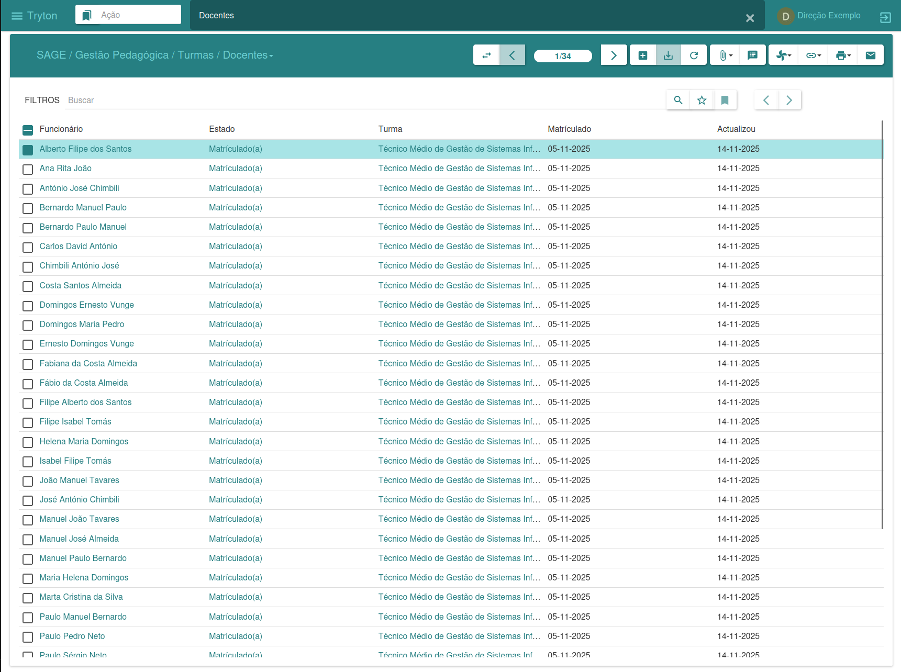
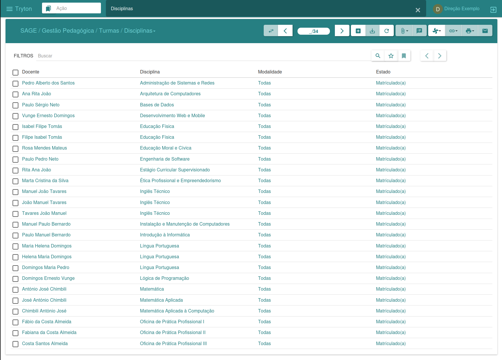
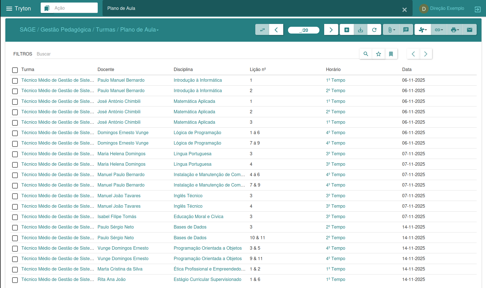
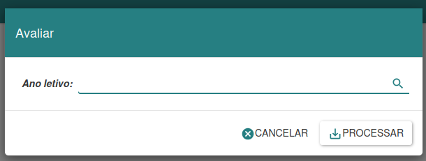

#### Gestion des classes

Le menu « Classes » permet de gérer les classes : création de nouvelles classes, association des élèves et des enseignants avec leurs matières respectives, ainsi que création des emplois du temps et des plans de cours. Pour créer de nouvelles classes, il est nécessaire d’avoir préalablement défini une année scolaire, des plans d’études et les évaluations correspondantes.

En cliquant sur le bouton « Nouveau », vous pouvez saisir les données de la classe, notamment le nombre d'élèves et d'enseignants. Dans l'onglet « Élèves », vous pouvez associer les nouveaux élèves à leurs matières respectives ; et dans l'onglet « Enseignants », vous pouvez spécifier les matières qui seront enseignées. Dans la section « Emploi du temps », vous pouvez définir l'horaire de chaque cours, tandis que dans la section « Plan de cours », vous conservez un historique des cours dispensés par les enseignants. Une fois terminé, cliquez sur « Enregistrer » pour confirmer les modifications. Cette approche permet une gestion efficace et organisée des activités liées aux cours.

---

##### Élèves

L'interface « Élèves » permet une gestion efficace des élèves, regroupant les informations disponibles dans la section « Élèves » des cours. La gestion peut être effectuée dans cette section ou dans la section « Cours ». Ces deux options offrent des outils pour gérer et contrôler les informations relatives aux élèves, offrant ainsi une grande flexibilité dans l'administration pédagogique.

---

##### Enseignant

L'interface réservée aux enseignants permet de gérer les informations relatives aux professeurs. Cette gestion peut s'effectuer aussi bien dans cette section que dans la section dédiée aux cours. Ces deux options offrent des outils pour administrer et contrôler les données des professeurs, assurant ainsi une grande flexibilité dans la gestion pédagogique.

---

##### Discipline

L'interface de la matière offre la possibilité de générer et d'imprimer des feuilles de réponses d'examen spécifiques, des formulaires de recours et des mini-emplois du temps, selon la matière sélectionnée.

---

##### Plan de leçon

L'interface de planification des leçons permet aux enseignants de saisir leurs plans de leçon, conservant ainsi une trace des leçons dispensées tout au long de l'année scolaire.

---

##### Évaluation de la classe

À la fin de chaque année scolaire, la classe évalue les performances des élèves dans une matière donnée. Cela permet de déterminer quels élèves passeront en classe supérieure et lesquels devront redoubler.

L'assistant permet d'évaluer la classe pour l'année sélectionnée. Après avoir fait votre choix, cliquez sur « Continuer » pour poursuivre l'évaluation ou sur « Annuler » pour interrompre l'opération. Cet outil offre une évaluation complète des performances scolaires et facilite les décisions relatives à la progression des élèves.

