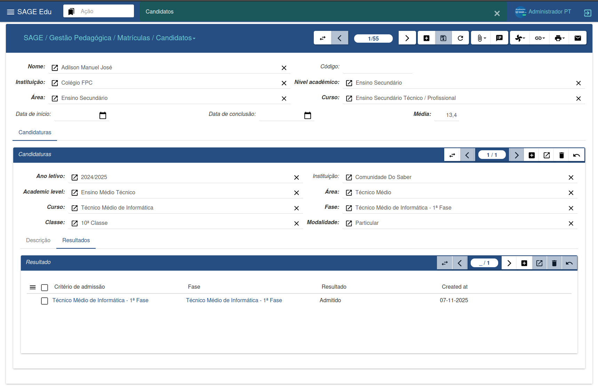
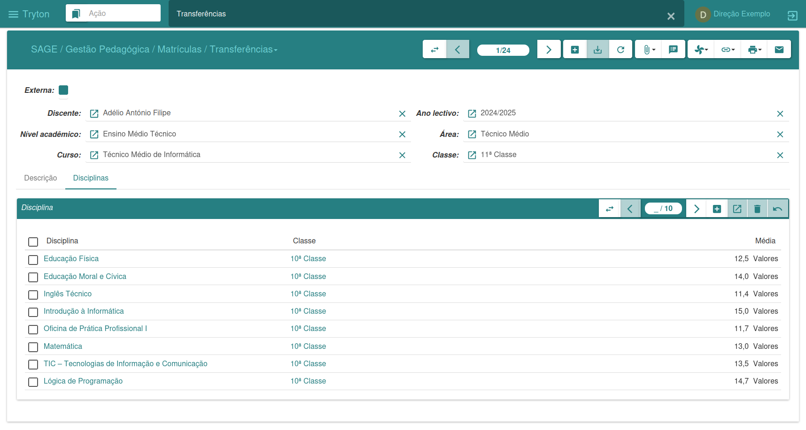
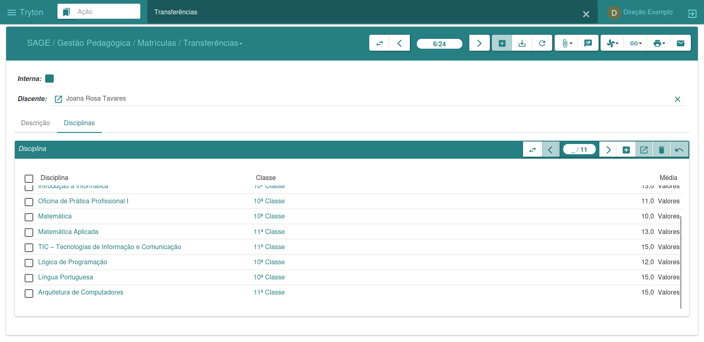
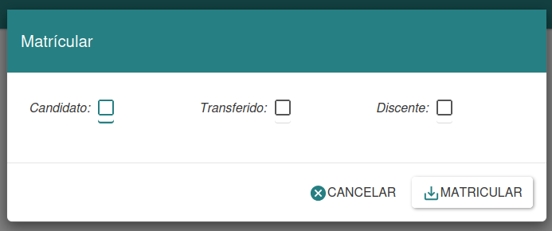
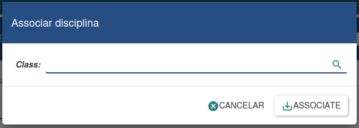
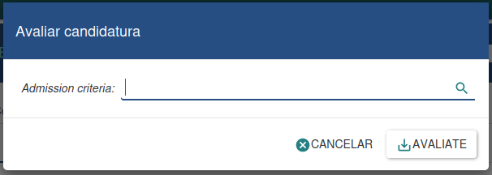
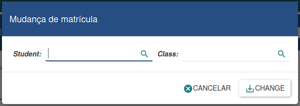

#### Gestion des inscriptions

Le service des inscriptions est responsable de la gestion des inscriptions, des cours et des évaluations. Il assure le suivi de toutes les activités académiques des étudiants et des enseignants, facilite la délivrance des documents, la publication des agendas et répond aux besoins des usagers du service des inscriptions et de l'administration de l'établissement.

#### Candidats

L'image ci-dessus présente les informations relatives à une candidature. Il est possible de consulter les données concernant le niveau d'études, la phase, la modalité et le résultat final de la candidature.

---

##### Transferts

Cette section permet de gérer deux types de transferts : internes et externes.

* Un transfert interne concerne un étudiant qui quitte l’établissement pour en intégrer un autre.

* Un transfert externe concerne un étudiant qui intègre l’établissement en provenance d’un autre établissement.

**Transferts internes**

Pour enregistrer un nouveau transfert interne, l’étudiant doit être préalablement inscrit dans le système. Procédez ensuite comme suit :

1. Cliquez sur « Nouveau ».

2. Recherchez l’étudiant dont vous souhaitez signaler le transfert.

3. Vous pouvez ajouter une description et associer les matières déjà inscrites à son dossier scolaire.

4. Cliquez sur « Enregistrer » et confirmez l’opération.

**Transferts externes**

Pour enregistrer un transfert externe :

1. Cliquez sur « Nouveau »

2. Recherchez l’établissement d’origine de l’étudiant transféré

3. Remplissez les champs restants

4. Cliquez sur « Enregistrer » et confirmez

Si vous souhaitez indiquer les matières suivies par l’étudiant dans un autre établissement, saisissez simplement le nom de la matière, le cours et la note. Ainsi, lors de l’inscription, le système pourra identifier correctement le cours dans lequel l’étudiant doit être placé.

---

##### Processus d'inscription

L'assistant d'inscription vous permet d'inscrire des étudiants en temps réel. Vous devez préciser le type d'inscription : candidat, étudiant en transfert ou étudiant déjà inscrit.

Pour inscrire un étudiant :

1. Sélectionnez le type d'inscription souhaité.

2. Remplissez les champs obligatoires.

3. Cliquez sur « Inscrire » pour continuer.

4. Si vous souhaitez annuler, cliquez sur « Annuler ».

5. Cette méthode garantit flexibilité et contrôle du processus d'inscription.

---

##### Attribution des cours

L'assistant d'attribution des cours vous permet d'associer des cours d'une classe spécifique à certains étudiants. Il est utilisé lorsqu'un étudiant est inscrit à une classe mais n'a pas encore de cours rattachés à son profil.

Pour effectuer l'association :

1. Saisissez la classe souhaitée.

2. Cliquez sur « Associer ».

3. Pour annuler, cliquez sur « Annuler ».

Cet assistant facilite l'organisation des cours attribués aux étudiants, garantissant ainsi une gestion efficace du cursus.

---

##### Évaluation des candidatures

L'assistant d'évaluation des candidatures vous permet d'analyser les candidats inscrits et de déterminer leur admissibilité.

Pour effectuer l'évaluation :

1. Spécifiez les critères d'admission souhaités.

2. Toutes les candidatures répondant à ces critères seront prises en compte.

3. Cliquez sur « Évaluer » pour lancer le processus.

4. Si nécessaire, cliquez sur « Annuler » pour annuler l'opération.

Cet outil garantit un processus de sélection rigoureux, efficace et transparent.

---

Modification d'inscription étudiante

L'outil de modification d'inscription vous permet de transférer un étudiant vers un autre département, cours, classe ou semestre.

Pour effectuer la modification :

1. Sélectionnez l'étudiant concerné.

2. Indiquez la nouvelle classe ou le nouveau département.

3. Cliquez sur « Modifier » pour confirmer.

Cet outil offre une grande flexibilité dans la gestion des études, permettant des ajustements en fonction des besoins des étudiants et de l'établissement.

