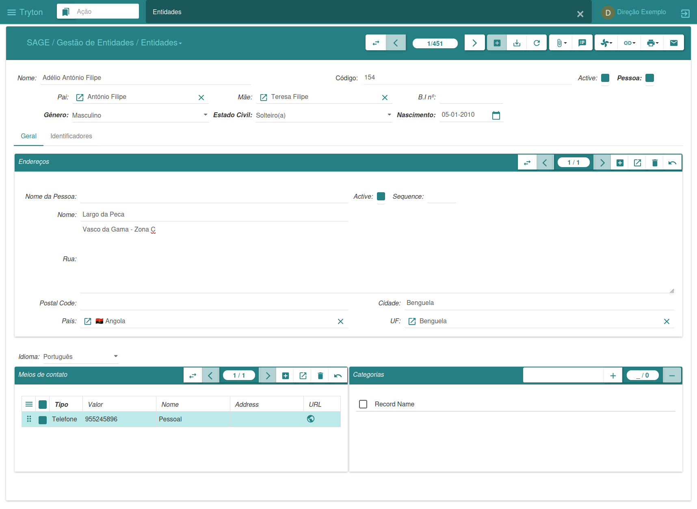
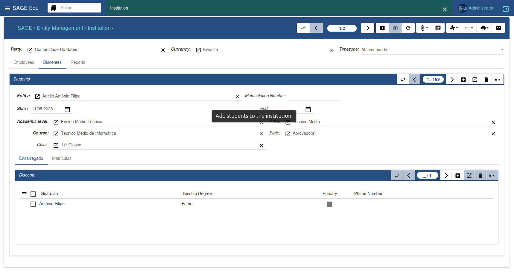
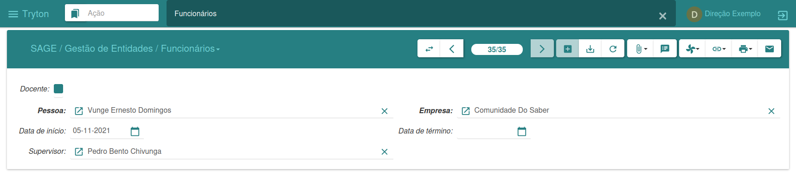
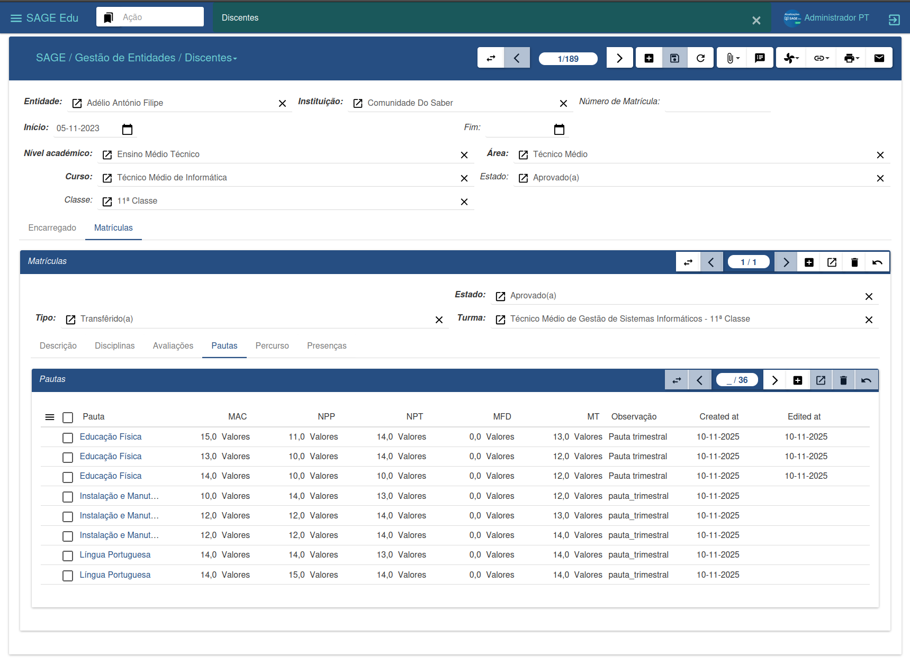

#### Gestion des entités

La fonction principale du menu Gestion des entités est de gérer les entités du système. Chaque entité peut représenter des personnes physiques ou morales, des organisations, des associations, des entreprises et tout type de groupe pouvant être considéré comme une entité dans le système.

Chaque entité peut être associée à :

* Des contacts
* Des adresses
* Des catégories
* Des identifiants
* Un type (Particulier ou Entreprise)

##### Entités

Pour créer une nouvelle entité :

1. Cliquez sur « Nouveau »

2. Remplissez les champs requis

3. Cliquez sur « Enregistrer ». La nouvelle entité est créée.

Après avoir créé l’entité, vous pouvez ajouter des contacts, des adresses, la langue et d’autres informations complémentaires.

---

##### Établissement

Pour créer un nouvel établissement :

1. Assurez-vous qu’une entité a déjà été créée.

2. Cliquez sur « Nouveau ».

3. Recherchez l’entité à associer.

4. Renseignez les informations restantes.

5. Cliquez sur « Enregistrer ». Le nouvel établissement est créé.

---

##### Employés

Le système propose deux méthodes d'enregistrement des employés :

1. Par établissement

* Menu : Établissement → Employés

2. Par sous-menu Général

* Menu : Employés

Pour enregistrer un employé :

1. Cliquez sur « Nouveau »

2. Remplissez les champs obligatoires

3. Si l'établissement n'est pas sélectionné, recherchez-le

4. Cliquez sur « Enregistrer »

---

##### Étudiants

Pour inscrire un étudiant :

1. Assurez-vous qu’une entité a déjà été créée.

2. Cliquez sur « Nouveau ».

3. Recherchez l’entité.

4. Remplissez les champs supplémentaires.

5. Cliquez sur « Enregistrer ».

6. Confirmez l’inscription.

Vous pouvez consulter :

* Matières

* Évaluations

* Notes

* Relevé de notes

