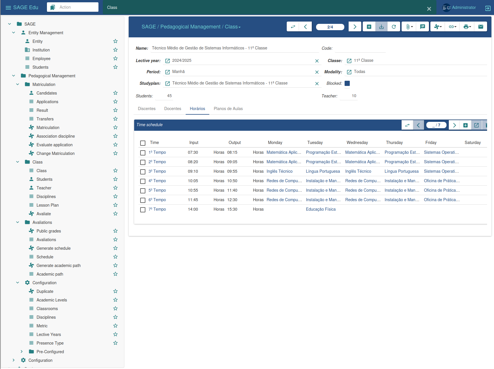

### Graphical Interface

Next, we will describe the work environment so that the user can become familiar with the interface and components that make up SAGE Education, aiming to facilitate the use of the platform.

The figure below shows the SAGE Education work environment, where most of the activities will be carried out; to do this, we will describe the options that this interface provides.

- ***Side Menu:*** The left side menu bar, or menu bar, allows us to access the functionalities of each module. It offers various options depending on the installed modules.

- ***Central Window:*** The central window allows the interface to switch between listing view and data editing. This area is responsible for this action during registration or editing.

- ***Top Bar:*** At the top of the interface, we have the top bar, where all open windows or menus are grouped.

 ***Management Bar:*** The management bar, or options bar, offers a series of functionalities. It allows for the management of all records, as well as the insertion of new registrations.

In it we can see that there are several buttons, each representing an action that gives us access to a specific activity. Let's start by describing the figure, from left to right.

 ***Change View***

It allows you to change the view of the information, switching from record listing to data editing, or vice versa.

 ***Back/Forward***

It allows you to move forward or backward to a specific record, regardless of the view you are in.

 ***New record***

It allows the insertion of new records into the platform.

 ***Save the changes in the record***

And it allows you to save new records, as well as the changes made to a specific record.

 ***Undo changes***

It allows you to revert changes made to a record before it was saved, and also allows you to update a given record or the record listing.

 ***Manage attachment***

Allows you to attach documents to a specific entity.

 ***Note*** 

It allows the user with access to the system to leave a message, note, or information on the selected record.

 ***Execute action***

It allows you to perform a specific action that has been previously defined.

 ***Relate***

It allows us to visualize the relationships between the different parts of the system and the record.

 ***Printer***

It offers the same functionalities as the report, with the only difference being that this one does not generate a digital document, but rather prints the document, thus generating a physical document.

 ***E-mail***

This allows us to send an email to the selected registration.

 ***Search bar***

It allows us to conduct research in a specific field.
