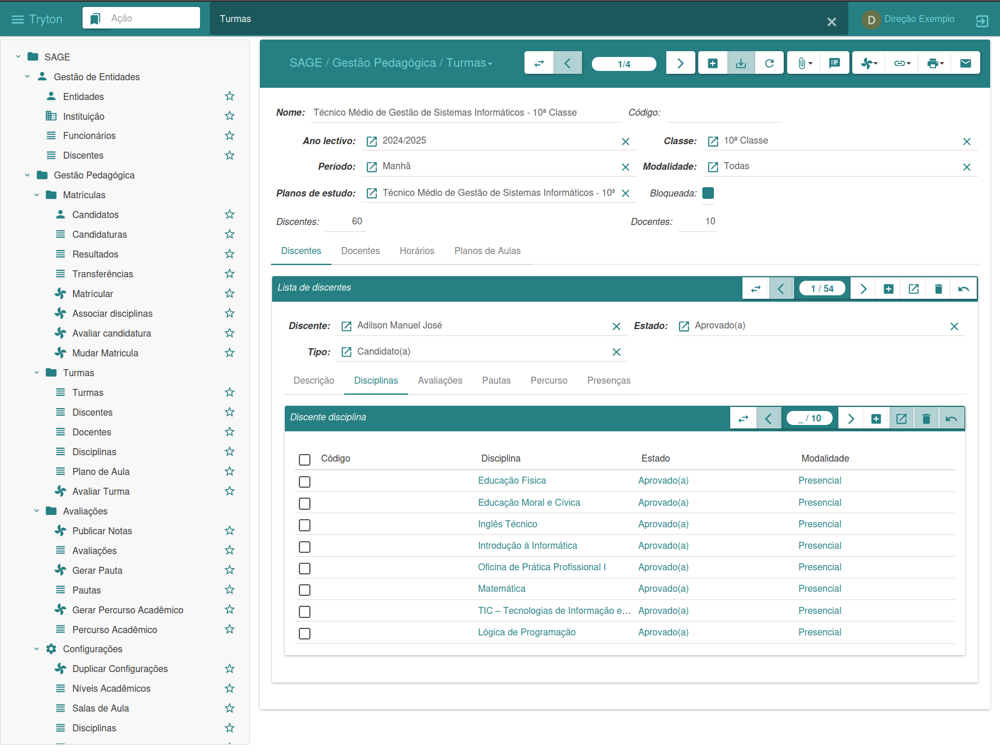
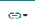

#### Interface Gráfica

A seguir iremos descrever o ambiente de trabalho de modo o utilizador familiarizar-se com a interface e componentes que constituem o SAGE Education, visando facilitar o uso da plataforma.
A figura abaixo apresenta o ambiente de trabalho SAGE Education, onde maior parte das atividades serão realizadas, para tal vamos fazer descrição das opção que esta interface dispõe.

- ***Menu lateral:*** a barra menu lateral esquerda ou barra de menu, permite que possamos acessar as funcionalidades de cada módulo, nela temos diversas opções de acordo aos módulos instalados.
- ***Janela central:*** a janela central permite que interface possa alternar entre vista de listagem ou edição de dados. No ato de cadastro ou edição de registo esta é a área responsável por esta ação.
- ***Barra superior:*** no topo da interface, temos a barra superior, onde são agrupas todas as janela ou menus que estão abertos.
- ***Barra de gestão:*** a barra de gestão ou opções dispões de uma serie de funcionalidade, ela permite fazer toda a gestão dos registos, bem como a inserção de novos cadastrados

Nela podemos observar que há vários botões, em que cada botão representa uma ação, que nós da acesso a uma determinada atividade, vamos começar por fazer a descrição da figura, da esquerda para a direita.

 ***Mudança de visão***

Ela permite alterar a visão das informações, muda de listagem de registo para edição de dados, ou vice versa.

 ***Voltar/Avançar***

Ela permite avançar ou regressar a um determinado registo, independente da visão em que estiver.

 ***Novo registo***

Ela permite a inserção de novos registos na plataforma.

 ***Salvar registo/alterações***

Eela permite salvar novos registos, bem com as alterações feitas em determinado registo.

 ***Anular alterações***

Permite reverter as alterações feitas em registo antes desse ser salvo, também permite atualizar um dado registo ou a listagem de registo.

 ***Gerir anexo***

Permite anexar documentos a uma determinada entidade.

 ***Apontamento*** 

Permite que o utilizador que estiver com acesso ao sistema possa deixar uma mensagem, nota ou informação ao registo que estiver selecionado.

 ***Executar ação***

Permite executar uma determinada ação, previamente definida.

 ***Relacionar***

Permite que visualizemos as relações entre as diferentes partes do sistema para com o registo.

 ***Impressora***

Permite as mesmas funcionalidades que o relatório, somente com o deferencial de que este não gera um documento digital, mas sim imprime o documento, gerando assim um documento físico.

 ***E-mail***

Permite que possamos enviar um e-mail ao registo selecionado.

 ***Barra de Pesquisa***

Permite que possamos realizar pesquisas, em um determinado campo.