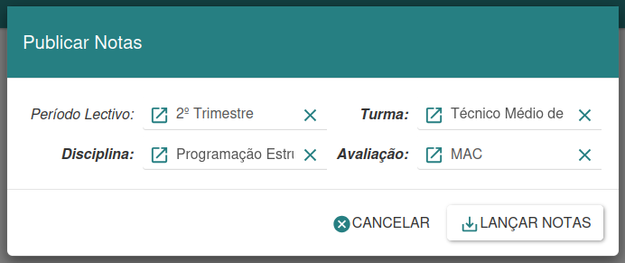
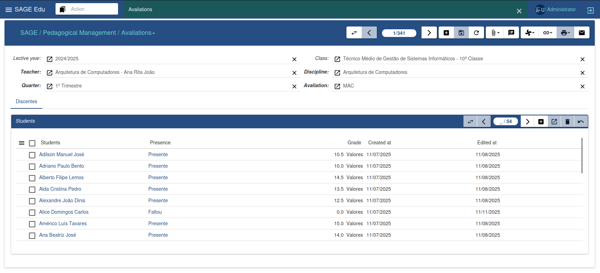
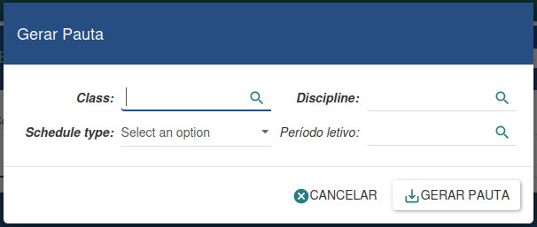
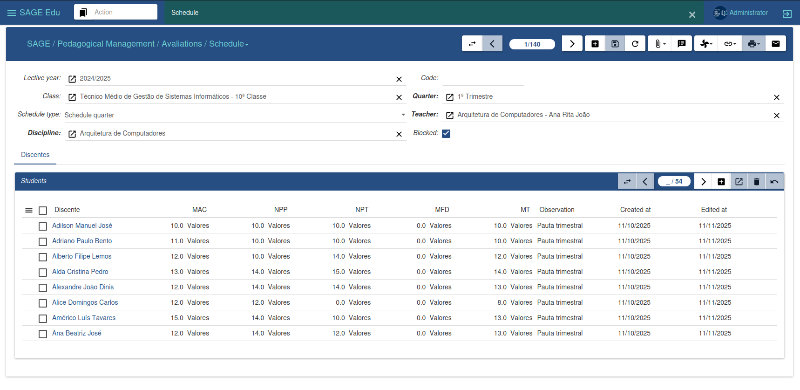
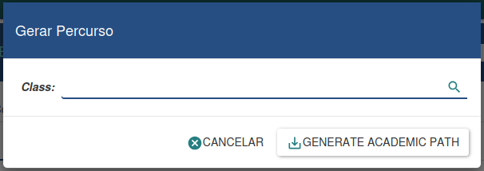
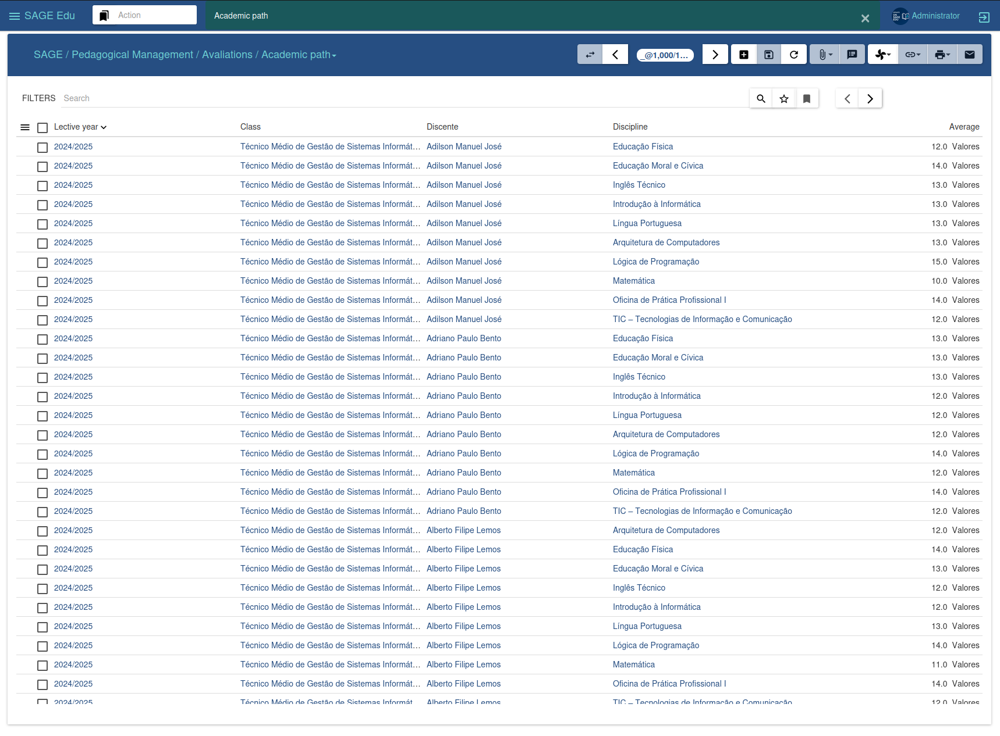

#### Gestion des évaluations

Gestion des évaluations

Le menu Évaluations permet de gérer les évaluations des élèves d'une classe. Vous pouvez y saisir les notes, créer des feuilles de notes et générer les relevés de notes scolaires.

---

##### Publication des notes

L'assistant de publication des notes simplifie l'attribution des notes aux élèves et permet de générer facilement une liste d'élèves à partir des notes saisies.

Pour créer cette liste, vous devez préciser le semestre, la classe, la matière et l'évaluation pour lesquels vous souhaitez générer la liste. Cliquez ensuite sur « Saisir les notes » pour obtenir la liste de tous les étudiants inscrits à la matière.

Si vous ne souhaitez pas continuer, vous pouvez cliquer sur « Annuler ». Cet outil simplifie le processus de saisie des notes.

---

##### Évaluations

La gestion des évaluations s'effectue via cette interface, qui permet de consulter toutes les évaluations et, pour chacune d'elles, la liste des étudiants avec leurs notes respectives.

Pour attribuer des notes, sélectionnez une évaluation, recherchez l'élève concerné, puis saisissez ou modifiez la note correspondante. Cliquez ensuite sur « Enregistrer » pour sauvegarder les modifications.

Cette méthode permet de gérer et de mettre à jour efficacement les notes des élèves tout au long du processus d'évaluation.

---

##### Générer un emploi du temps

L'assistant de génération d'emploi du temps vous permet de créer des emplois du temps dynamiquement, en saisissant uniquement les données nécessaires. L'emploi du temps est généré automatiquement, tous les calculs étant effectués selon les formules définies.

Pour créer un nouvel agenda, vous devez fournir les informations requises. Dans l'option « Type d'agenda », sélectionnez le format souhaité. Cliquez ensuite sur « Générer » pour créer l'agenda, ou sur « Annuler » si vous souhaitez annuler l'opération.

---

##### Emploi du temps

La gestion des emplois du temps s'effectue via cette interface, où vous pouvez consulter toutes les notes déjà générées.

Pour chaque note, une liste des élèves avec leurs notes respectives est disponible, offrant ainsi une vue d'ensemble des résultats scolaires de chaque élève.

Cette interface facilite l'analyse et le suivi des évaluations dans le temps, permettant une gestion efficace des informations relatives aux notes des élèves.

---

##### Générer un parcours académique

L'assistant de génération de parcours académique permet d'enregistrer les activités académiques d'une classe spécifique, c'est-à-dire les résultats des élèves qui y sont inscrits.

Cet outil offre un moyen efficace de documenter et d'analyser la progression scolaire au fil du temps, fournissant ainsi une vue d'ensemble complète du parcours éducatif des élèves de la classe.

---

##### Parcours scolaire

Le dossier scolaire permet de conserver les résultats des élèves tout au long d'une année scolaire donnée, fournissant des informations essentielles pour prendre des décisions concernant leur passage en classe supérieure ou leur maintien dans les études.

Cet outil fournit une analyse détaillée des performances scolaires, contribuant à l'évaluation des progrès des élèves et à la définition de leurs parcours éducatifs.
