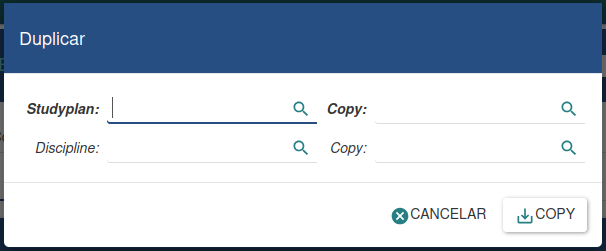
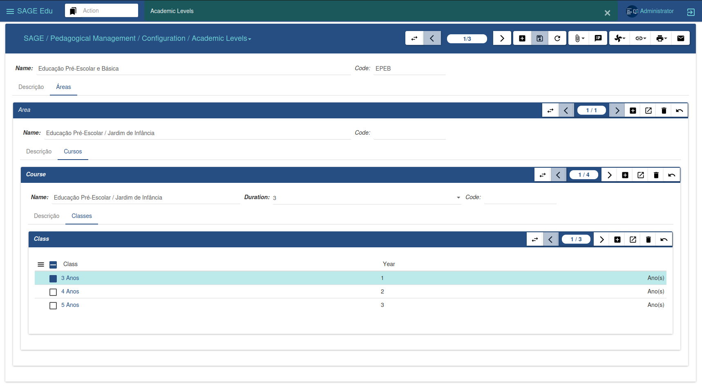
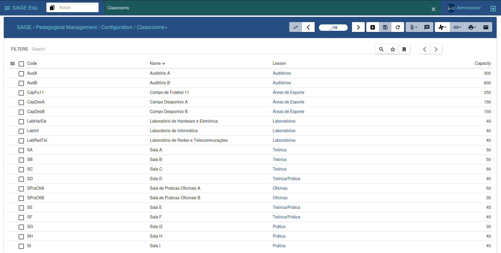
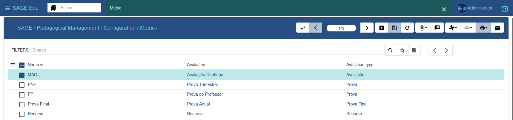
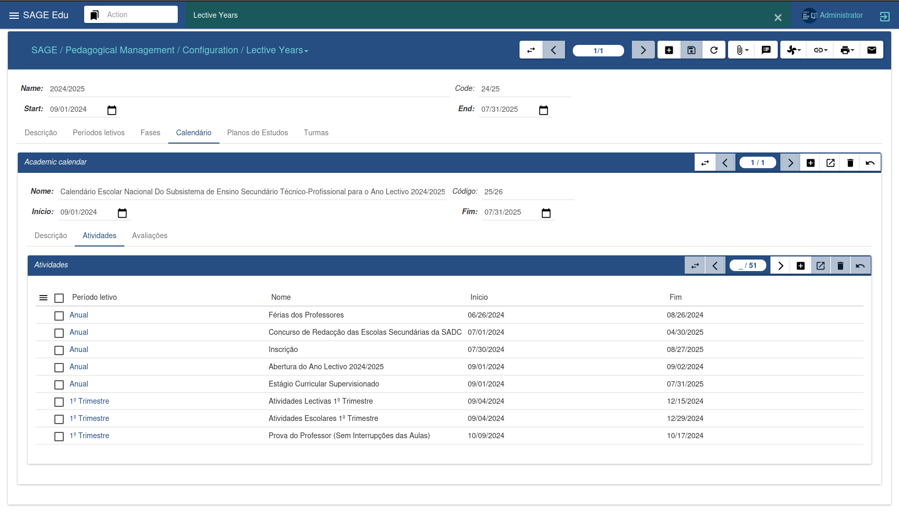

#### Paramètres

Le menu Paramètres permet de gérer l'inscription, le suivi et l'évaluation des étudiants par le département pédagogique de l'établissement.

Ce menu est indispensable pour configurer et personnaliser le système en fonction des besoins, des normes et des règles de l'établissement, garantissant ainsi son efficacité et sa conformité aux politiques et procédures pédagogiques.

#### Duplication

L'assistant de duplication permet de créer des copies d'informations d'un plan d'études à un autre. Cette fonctionnalité permet de dupliquer aussi bien les matières que les évaluations.

Pour dupliquer des matières, il suffit de spécifier les plans d'études souhaités.

Pour dupliquer des évaluations, il faut également spécifier les matières concernées.

Après avoir saisi ces informations, cliquez simplement sur « Copier » pour les dupliquer ou sur « Annuler » pour annuler l'opération.

Cet outil simplifie la réplication des informations entre les différentes années d'études pour des parcours d'études spécifiques, ce qui permet une gestion académique plus rapide et plus efficace.

---

##### Niveaux d'études

L'interface des niveaux d'études vous permet de gérer les niveaux proposés par l'établissement.

Vous pouvez y consulter tous les niveaux existants, en ajouter de nouveaux et définir leurs caractéristiques spécifiques.

---

##### Salle de classe

La gestion des salles de classe s'effectue via cette interface, qui permet également l'enregistrement de nouvelles salles.

Pour créer une salle de classe, cliquez simplement sur « Nouveau », saisissez les informations requises, puis cliquez sur « Enregistrer » pour terminer.

---

##### Métriques

La gestion des métriques (ou évaluations) s'effectue dans cette interface, où vous pouvez consulter toutes les métriques existantes.

Pour créer une nouvelle métrique, cliquez simplement sur « Nouveau », saisissez les données nécessaires, puis cliquez sur « Enregistrer ».

Chaque métrique contient des informations telles que l'évaluation, le type d'évaluation et le nom de la métrique.

---
##### Année scolaire

L'interface de l'année scolaire permet une gestion complète des périodes académiques.

Vous pouvez y définir les trimestres, les phases et les critères d'admission, les plans d'études et créer de nouvelles classes.

En cliquant sur « Nouveau », vous pouvez créer une nouvelle année scolaire en précisant les dates de début et de fin souhaitées.

* Pour définir les trimestres, cliquez sur l'onglet « Trimestres ». En cliquant sur « Nouveau », ajoutez les périodes académiques souhaitées.

* Pour définir les phases d'admission, cliquez sur l'onglet « Phases ». Dans « Nouveau », ajoutez les phases et leurs critères d'admission respectifs.

* Pour définir les plans d'études pour l'année académique, cliquez sur l'onglet « Plans d'études ». Dans « Nouveau », saisissez les nouveaux plans, ainsi que les matières et les évaluations qui les composent.

De plus, il est possible de créer de nouvelles classes directement depuis cette interface, si vous ne souhaitez pas effectuer cette action via le menu « Classes ».

Ces ressources permettent une gestion complète et intégrée des éléments clés liés à l'année académique.

**Remarque**

Dans le menu des paramètres, un sous-menu intitulé « Préconfiguré » propose des paramètres prêts à l'emploi.

D'autres paramètres peuvent être ajoutés selon les besoins de l'établissement.