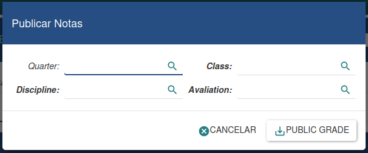
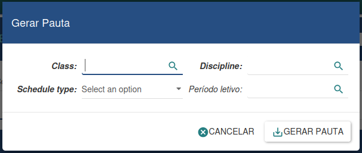
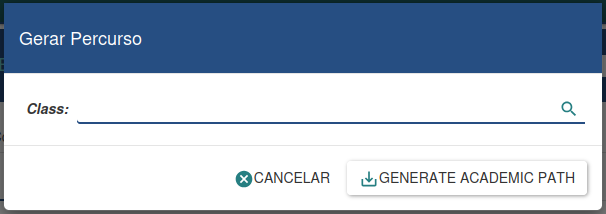
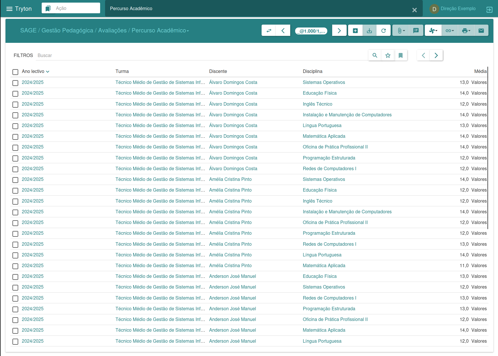

#### Gestão de Avaliações

Gestão de Avaliações

O menu Avaliações é responsável por fazer a gestão das avaliações dos discentes de uma dada turma. Nele, é possível lançar notas, criar pautas e gerar o histórico académico dos estudantes.

---

##### Publicar Notas

O assistente de publicação de notas simplifica a atribuição de notas aos alunos, facilitando a geração de uma lista nominal de discentes com base nas avaliações inseridas.

Para criar essa lista, é necessário informar o trimestre, a turma, a disciplina e a avaliação para a qual desejamos gerar a lista. Em seguida, clicamos em "Lançar Notas", resultando numa lista nominal de todos os discentes matriculados na disciplina.

Caso não desejemos prosseguir, temos a opção de clicar em "Cancelar". Essa ferramenta simplifica o processo de publicação de notas.

---

##### Avaliações

A gestão de avaliações é conduzida por meio desta interface, permitindo a visualização de todas as avaliações e, para cada uma delas, a listagem dos discentes com as suas respetivas notas.

Para atribuir notas, basta selecionar uma avaliação específica, buscar pelo discente desejado e, em seguida, inserir ou alterar a nota correspondente. Após realizar as alterações, clicamos em "Salvar" para registar as mudanças.
Essa abordagem oferece uma forma eficaz de gerir e atualizar as notas dos estudantes durante o processo de avaliação académica.

---

##### Gerar Pautas

O assistente de geração de pautas permite criar pautas de forma dinâmica, exigindo apenas a inserção dos dados necessários. A pauta é gerada automaticamente com todos os cálculos elaborados com base nas fórmulas definidas.

Para criar uma nova pauta, é necessário fornecer os dados obrigatórios. Na opção Tipo de Pauta, selecionamos o formato desejado. Em seguida, clicamos em "Gerar" para criar a pauta, ou em "Cancelar" caso desejemos anular o processo.

---

##### Pautas

A gestão de pautas é realizada através desta interface, na qual é possível visualizar todas as pautas já geradas.
Para cada pauta, é disponibilizada uma listagem dos discentes com as suas respetivas notas, proporcionando uma visão abrangente do desempenho académico de cada aluno.

Essa interface facilita a análise e o acompanhamento das avaliações ao longo do tempo, permitindo uma gestão eficaz das informações relacionadas às notas dos discentes.

---

##### Gerar Percurso

O assistente de geração de percurso académico possibilita registar as atividades académicas de uma turma específica, ou seja, o desempenho dos discentes nela matriculados.

Essa ferramenta oferece uma forma eficiente de documentar e analisar o progresso académico ao longo do tempo, proporcionando uma visão completa do percurso educacional dos alunos da turma.

---

##### Percurso Académico

O percurso académico permite armazenar o desempenho obtido pelos discentes ao longo de um determinado ano letivo, oferecendo informações cruciais para a tomada de decisões quanto à progressão ou retenção dos alunos.

Essa ferramenta fornece uma análise detalhada do rendimento académico, auxiliando na avaliação do progresso dos estudantes e na definição das suas trajetórias educacionais.
