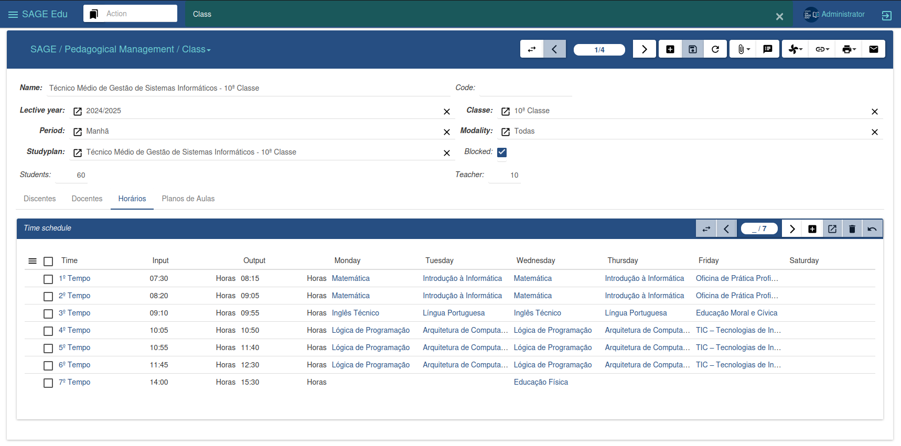
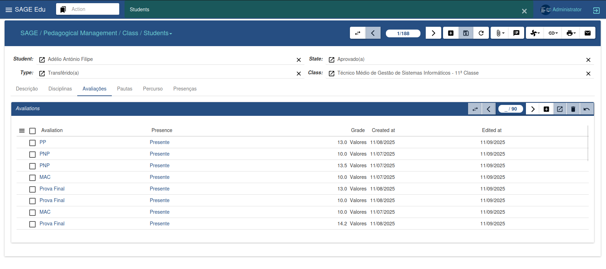
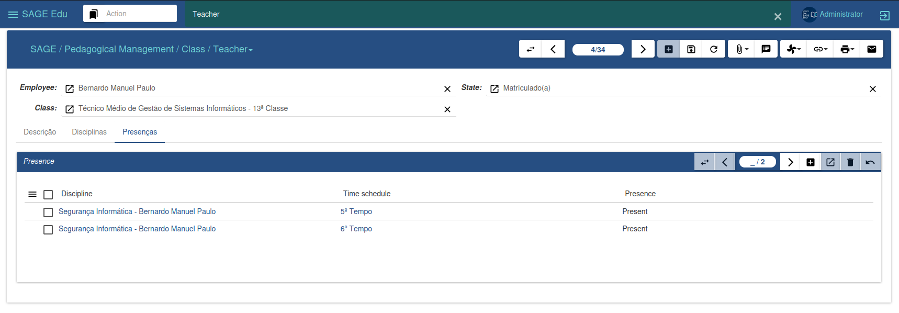
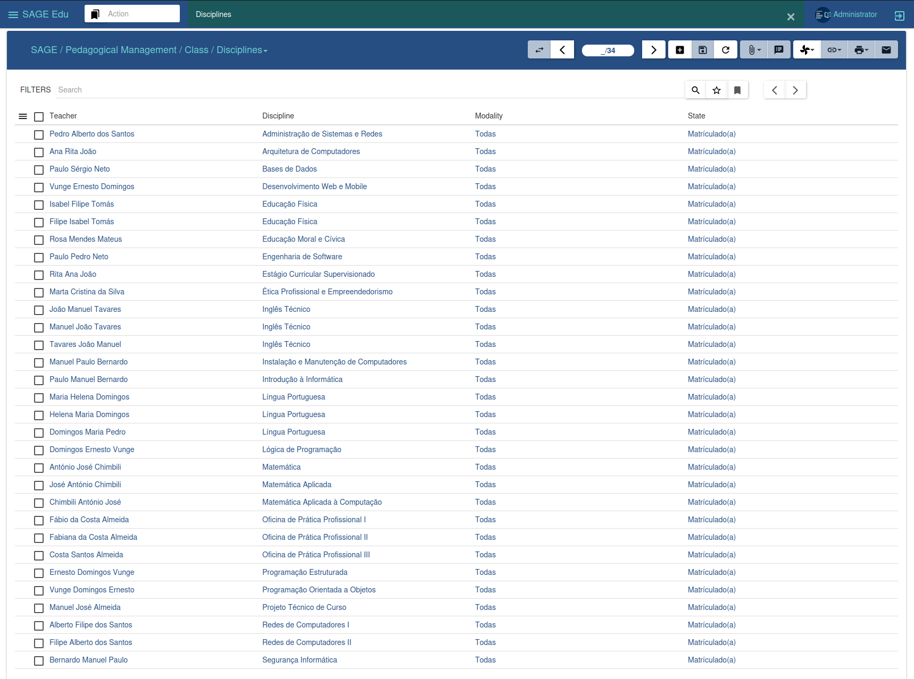
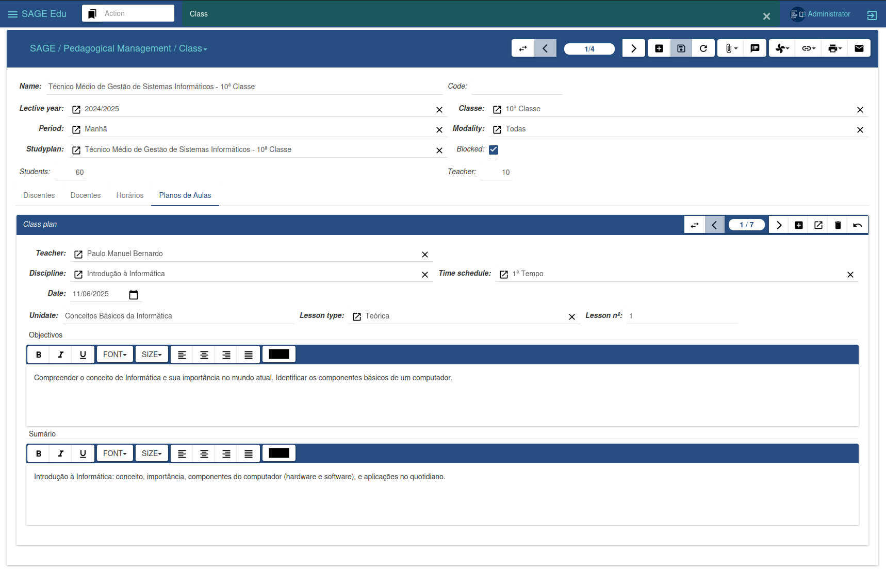

#### Class Management

The Classes menu is responsible for managing classes, allowing the creation of new classes, the association of students and teachers along with their respective subjects, as well as the creation of schedules and lesson plans. To register new classes, it is necessary to have previously defined an academic year, study plans, and the respective assessments.

By clicking the “New” button, you can enter the class data, including the student and teacher limits. In the student tab, you can associate new students with their corresponding subjects; and in the teacher tab, you can specify the subjects that will be taught in the class. In the timetable section, you can define the class time for each lesson, while in the Lesson Plan area we keep a record of the lessons taught by the teachers. When finished, we click Save to confirm the changes. This approach provides efficient and organized management of activities related to classes.

---

##### Students

The student interface enables effective student management, containing the information available in the student section within classes. Management can be done in this specific section as well as in the class section. Both options offer resources to manage and control student-related information, providing flexibility in academic administration.

---

##### Teacher

The faculty interface offers the ability to manage information related to professors. Management can be performed both in this specific section and in the class section. Both options provide resources to administer and control professor data, offering flexibility in academic management.

---

##### Discipline

The subject interface offers the ability to generate and print special exam answer sheets, appeals, and mini-schedules, according to the selected subject.

---

##### Lesson Plan

The lesson plan interface allows teachers to enter their lesson plans, thus maintaining a record of the lessons taught throughout the school year.

---

##### Evaluate Class

The class evaluate performance in a specific lective year at the end of each school year. This makes it possible to determine which students will progress to the next grade and which will need to repeat the year.

When using the assistant, it is possible to evaluating the class in the selected year. After making the desired choice,  click Proceed to continue the evaluation, or Cancel to undo the process. This tool provides a comprehensive assessment of academic performance, assisting in decision-making related to student progression.

