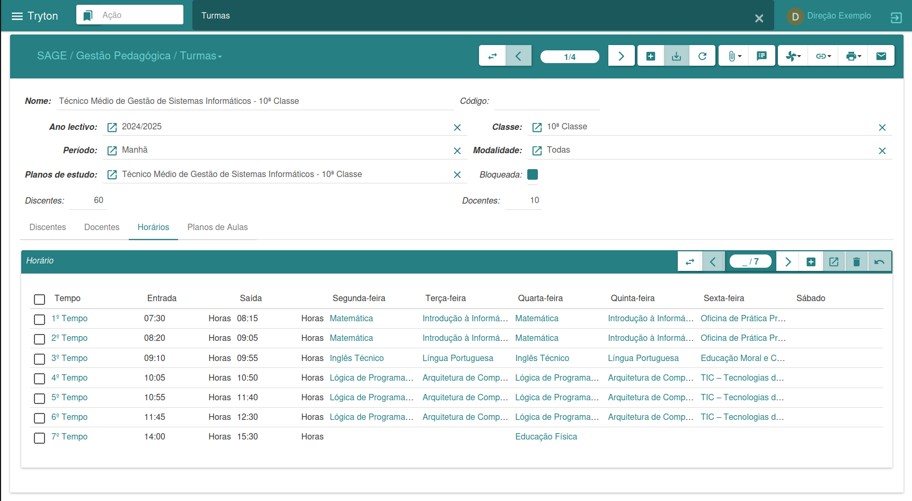
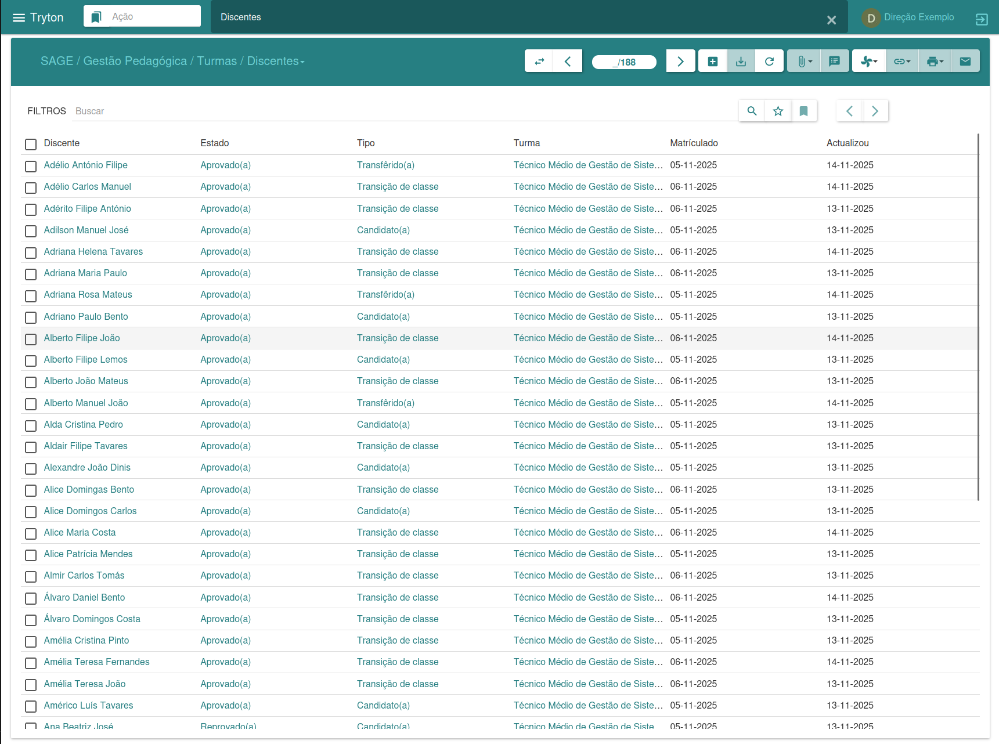
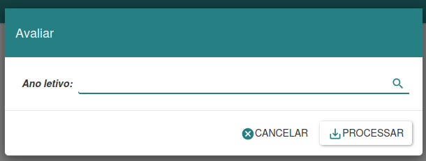

#### Gestão de Turmas

O menu Turmas é responsável por fazer a gestão das turmas, permitindo a criação de novas turmas, a associação de discentes e docentes juntamente com as suas respetivas disciplinas, além da elaboração de horários e planos de aula. Para cadastrar novas turmas, é necessário ter previamente definido um ano letivo, planos de estudo e as respetivas avaliações.

Ao clicar no botão “Novo”, é possível inserir os dados da turma, incluindo o limite de discentes e docentes. Na aba de discentes, é possível associar novos estudantes às suas disciplinas correspondentes; e, na aba de docentes, informar as disciplinas que serão lecionadas na turma. Na secção de horários, é possível definir o tempo letivo de cada aula, enquanto na área de Plano de Aula mantemos o registo das aulas ministradas pelos docentes. Ao finalizar, clicamos em Salvar para confirmar as alterações. Essa abordagem proporciona uma gestão eficiente e organizada das atividades relacionadas às turmas.

---

**Discentes**

A interface de discentes possibilita a administração efetiva dos estudantes, contendo as informações disponíveis na secção de discentes em turmas. A gestão pode ser feita tanto nesta secção específica quanto na secção de turmas. Ambas as opções oferecem funcionalidades para gerir e controlar informações relacionadas aos discentes, proporcionando flexibilidade na administração académica.

---

**Docentes**

A interface de docentes oferece a capacidade de gerir informações relacionadas aos professores. A gestão pode ser realizada tanto nesta secção específica quanto na secção de turmas. Ambas as opções disponibilizam funcionalidades para administrar e controlar os dados dos docentes, proporcionando flexibilidade na gestão académica.

---

**Disciplina**

A interface de disciplina oferece a capacidade de gerar e imprimir pautas de exame especial, recurso e mini-pautas, de acordo com a disciplina selecionada.

---

**Plano de Aula**

A interface de plano de aula permite aos docentes inserirem os seus planos de aula, mantendo assim um histórico das aulas lecionadas ao longo do ano letivo.

---

**Avaliar**

O assistente de avaliação de turmas ou discentes possibilita, ao final de cada ano letivo, avaliar o desempenho dos estudantes em uma turma específica. Isso permite determinar quais discentes irão progredir para a próxima série e quais precisarão repetir o ano.

Ao utilizar o assistente, é possível escolher entre avaliar a turma como um todo ou avaliar um discente em particular. Após fazer a escolha desejada, preenchemos os campos obrigatórios e clicamos em Prosseguir para continuar a avaliação, ou em Cancelar para anular o processo. Essa ferramenta proporciona uma avaliação abrangente do desempenho académico, auxiliando na tomada de decisões relacionadas à progressão dos discentes.

