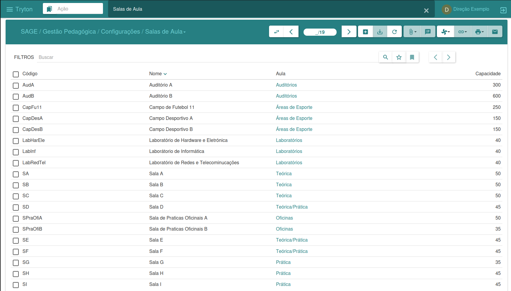
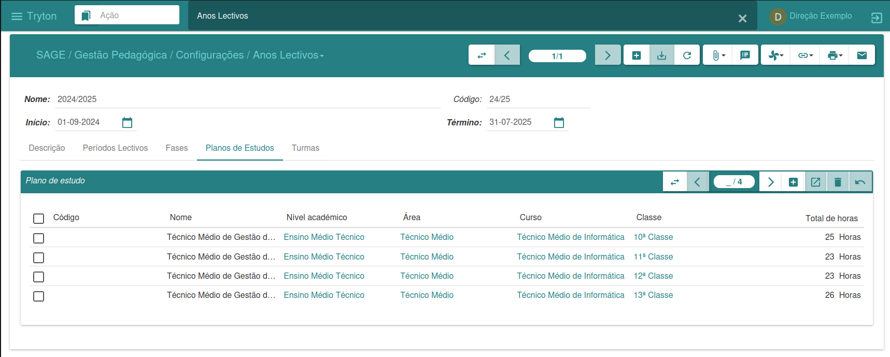

#### Configurações

O menu de configurações tem como finalidade oferecer suporte às operações de matrícula, acompanhamento e avaliação dos discentes pela área pedagógica da instituição.
Esse menu é essencial para configurar e personalizar o sistema de acordo com as necessidades, normas e regras nas quais a instituição está inserida, garantindo assim eficiência e adequação às políticas e processos pedagógicos.

##### Duplicar

O assistente de duplicação permite criar cópias das informações de um plano de estudos para outro. Essa funcionalidade possibilita duplicar tanto disciplinas quanto avaliações de um plano para outro.

Para duplicar disciplinas, é necessário informar apenas os planos de estudos desejados.
Caso se pretenda duplicar avaliações, será necessário informar também as disciplinas para as quais se deseja realizar a cópia.

Após fornecer essas informações, basta clicar em "Copiar" para efetuar a duplicação ou em "Cancelar" para anular o processo.
Essa ferramenta simplifica o processo de replicação de informações entre diferentes anos letivos para determinados planos de estudos, proporcionando maior agilidade e eficiência na gestão académica.

---

##### Níveis Académicos

A interface de níveis académicos permite a gestão dos níveis oferecidos pela instituição.
Nela, é possível visualizar todos os níveis existentes, adicionar novos níveis e definir as suas características específicas.

---

##### Sala de Aulas

A gestão de salas de aula é realizada nesta interface, permitindo o registo de novas salas.
Para criar uma sala de aula, basta clicar em "Novo", inserir os dados necessários e, em seguida, clicar em "Salvar" para concluir o processo.

---

##### Métricas

A gestão de métricas (ou avaliações) é feita nesta interface, onde é possível visualizar todas as métricas existentes.
Para criar uma nova métrica, basta clicar em "Novo", informar os dados necessários e, em seguida, clicar em "Salvar".

Cada métrica contém informações como a avaliação, o tipo de avaliação e o nome da métrica.

---

##### Ano Letivos

A interface de anos letivos permite realizar uma gestão completa dos períodos letivos.
Nela, é possível definir trimestres, fases e critérios de admissão, planos de estudos e criar novas turmas.

Ao clicar em "Novo", é possível criar um novo ano letivo, informando o período de início e fim desejado.

* Para definir os períodos trimestrais, clicamos na aba "Trimestres". Ao clicar em "Novo", adicionamos os períodos letivos desejados.

* Para definir as fases de admissão, clicamos na aba "Fases". Em "Novo", adicionamos as fases e seus respetivos critérios de admissão.

* Para definir os planos de estudos do ano letivo, clicamos na aba "Planos de Estudos". Em "Novo", incluímos novos planos, bem como as disciplinas e avaliações que farão parte de cada um.

Além disso, é possível criar novas turmas diretamente por esta interface, caso não se deseje realizar essa ação pelo menu Turmas.
Essas funcionalidades proporcionam uma gestão abrangente e integrada dos elementos-chave associados ao ano letivo.

**Observação**

No menu de configurações existe o sub-menu Pré-Configurados, onde estão disponíveis algumas configurações prontas para uso.
Podem ser adicionadas outras configurações conforme as necessidades da instituição.