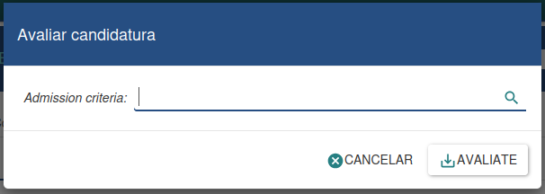
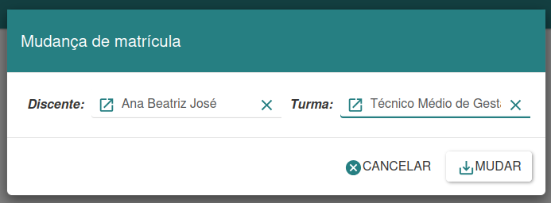

#### Gestão de Matrículas

A sessão  da secretária é responsável por fazer a gestão das matrículas, turmas e avaliações. Nele é possível manter o controle de toda a vida académica dos discentes e docentes, facilitando assim a emissão de documentos, publicação de pautas e prestar as devidas respostas aos utentes da secretária e a direção da instituição.

**Candidatos**

Para que possamos cadastrar uma novos candidatos, primeiro temos de  ter uma entidade previamente criada no sistema. Após isto clicamos na opção novo, em seguida procuramos pela entidade que desejamos identificar como candidato, após a inserção dos demais dados clica-se em salvar, confirmamos e a o novo candidato estará cadastrado.
Além de possibilitar a gestão de candidatos, essa interface também permite gerir as candidaturas, possibilitando a realização de candidaturas para vagas específicas.

Além de possibilitar a gestão de candidatos, na imagem acima podemos observar as informações de uma determinada candidatura vinculada ao candidato, é possível visualizar todas as informações importantes relacionada a candidatura, como nível académico, fase, modalidade e saber o resultado da candidatura.

**Transferências**

Esta sessão permite a gestão de duas modalidades de transferências, interna e externas, quando for interna refere-se a discentes que estão saindo da instituição e pretende ingressar em uma outra, já a transferências externa  permite aceitar discentes que estão vindo de uma outra instituição.

* Transferências internas:
Para que possamos cadastrar uma novas transferência, primeiro temos de ter um discente previamente matriculado no sistema. Após isto clicamos na opção novo, em seguida procuramos pelo discente que desejamos identificar como transferido, podemos adicionar uma descrição e associar as disciplinas existentes no percurso académico, clicamos em salvar confirma-se que sim e o discente será dado como transferido.

* Transferências externas
Para que possamos cadastrar uma novas transferência, primeiro temos de ter um discente previamente matriculado no sistema. Após isto clica-se na opção novo, em seguida procuramos pela entidade que desejamos identificar como transferido, após a inserção dos demais dados clicamos em salvar, confirma-se que sim e a o nova transferência estará  registada no sistema.
Caso deseja informar as disciplinas que o novo discente tenha frequentado basta informar o nome da disciplina, classe e média. Para que no momento da matrícula o sistema possa identificar de forma correta a classe para onde a matrícula devera ser feita.

**Efetuar Matrícula**

O assistente de matrículas possibilita a realização de matrículas de forma dinâmica. Nessa ferramenta, é necessário informar o tipo de matrícula, seja para candidatos, transferidos ou discentes previamente matriculados.
Para efetuar uma matrícula, o processo inicia-se ao informar o tipo de matrícula desejada. Em seguida, preenchemos os campos necessários. Após isso, clicamos no botão de matricular para dar continuidade ao processo de matrícula ou, caso desejemos cancelar, optamos pela opção "Cancelar" para anular o procedimento. Essa abordagem garante uma gestão eficiente do processo de matrícula, proporcionando flexibilidade e controle.

**Associar Disciplina**

O assistente de associação de disciplinas possibilita a associação de disciplinas de uma turma específica a determinados discentes. Este assistente é utilizado quando um discente está matriculado em uma turma, mas ainda não possui disciplinas associadas a ele.
Para realizar a associação de disciplinas, é preciso informar a turma desejada. Em seguida, clicamos no botão "Associar" para efetuar a vinculação das disciplinas ao discente. Se desejarmos cancelar o processo, basta clicar em "Cancelar". Esse assistente facilita a organização das disciplinas atribuídas aos discentes, garantindo uma gestão eficiente do currículo académico.

**Avaliar Candidatura**

O assistente de avaliação de candidaturas possibilita a análise dos candidatos que se candidataram a uma vaga na instituição, determinando se serão aprovados ou reprovados.
Para realizar a avaliação de candidaturas, é necessário informar o critério de admissão desejado. Todas as candidaturas que atendem a esse critério serão avaliadas. Ao clicar no botão "Avaliar", o processo de avaliação é iniciado. Caso seja desejado cancelar o processo, é possível clicar em "Cancelar" para anular a avaliação em curso. Essa ferramenta proporciona uma avaliação eficaz dos candidatos, garantindo uma seleção criteriosa e transparente.

**Mudança de Matrícula**

O assistente de mudança de matrículas possibilita a transferência do discente para uma área, curso, turma ou período.
Para efetuar a mudança de matrícula, é necessário primeiro selecionar o discente desejado e, em seguida, indicar a nova turma que ele frequentará. Após essa etapa, clicamos no botão "Mudar" para prosseguir com o processo de mudança de matrícula. Essa ferramenta oferece flexibilidade na gestão académica, permitindo ajustes conforme as necessidades dos discentes e da instituição.

