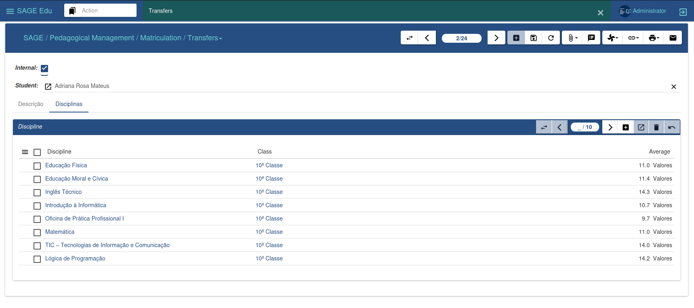

#### Enrollment Management

The registrar's office is responsible for managing enrollments, classes, and assessments. It allows for the control of all academic activities of students and faculty, facilitating the issuance of documents, the publication of agendas, and addressing the needs of users of the registrar's office and the institution's administration.

##### Candidates

In the image above, we can see the information of an application linked to the candidate. It is possible to view data related to the academic level, phase, modality, and the final result of the application.

---

##### Transfers

This section allows the management of two types of transfers: internal and external.

* Internal transfer refers to students leaving the institution to join another.

* External transfer refers to students entering the institution from another institution.

**Internal Transfers**

To register a new internal transfer, a student must be previously enrolled in the system. Then:

1. Click on “New”

2. Search for the student you wish to identify as transferred

3. You can add a description and associate existing subjects in their academic record

4. Click on “Save” and confirm the operation.

**External Transfers**

To register an external transfer:

1. Click on “New”

2. Search for the institution you wish to identify as the transferred student

3. Fill in the remaining data

4. Click on “Save” and confirm

If you wish to inform the subjects the student took at another institution, simply enter the subject name, class, and grade. This way, at the time of enrollment, the system can correctly identify the class where the student should be placed.

---

##### Enrollment Process

The enrollment assistant allows you to enroll students dynamically. You need to specify the type of enrollment — candidate, transfer student, or previously enrolled student.

To enroll:

1. Select the desired enrollment type.

2. Fill in the required fields.

3. Click "Enroll" to continue.

4. If you wish to cancel, click "Cancel".

5. This approach ensures flexibility and control in the enrollment process.

---

##### Assigning Discipline

The course assignment wizard allows you to associate courses from a specific class to certain students. It is used when a student is enrolled in a class but does not yet have any courses linked to them.

To perform the association:

1. Enter the desired class

2. Click on “Associate”

3. If you wish to cancel, click on “Cancel”

This wizard facilitates the organization of courses assigned to students, ensuring efficient management of the academic curriculum.

---

##### Evaluate Applications

The application evaluation assistant allows you to analyze registered candidates and determine whether they will be approved or rejected.

To perform the evaluation:

1. Specify the desired admission criteria.

2. All applications that meet these criteria will be included.

3. Click "Evaluate" to start the process.

4. If necessary, click "Cancel" to undo the operation.

This tool ensures a thorough, efficient, and transparent selection process.

---

##### Student Registration Change

The registration change tool allows you to transfer a student to another area, course, class, or semester.

To make the change:

1. Select the desired student

2. Indicate the new class or destination

3. Click "Change" to confirm

This tool offers flexibility in academic management, allowing adjustments according to the needs of students and the institution.

