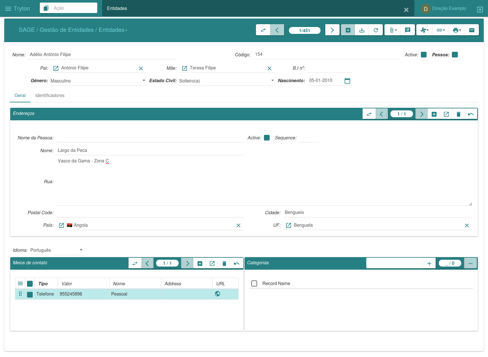
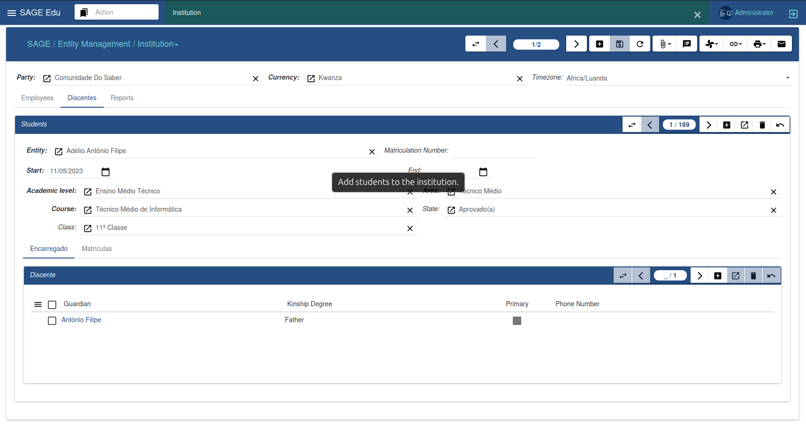
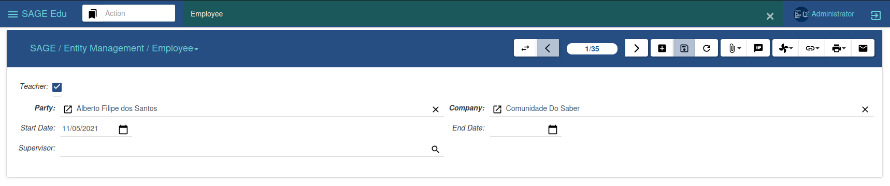

#### Gestão de Entidades

O menu de gestão de entidades tem como função principal gerir as entidades no sistema. Cada entidade pode representar uma pessoa singular ou jurídica, negócios, organizações, associações ou qualquer outro tipo de grupo que possa ser tratado como uma entidade.
Para cada entidade, é possível associar contactos, endereços, categorias e identificadores. Além disso, é possível informar o tipo de entidade, seja ela singular ou corporativa.

**Entidades**

Para que possamos criar uma nova entidade primeiro temos de clicar na opção novo, em seguida preencher os campos obrigatórios, após a inserção dos dados clicar em salvar. E a nova entidade está criada.
Caso deseje relacionar com outros dados, basta informar os dados de contactos telefónicos, endereço, idioma entre outras informações.

**Instituição**

Para que possamos cadastrar novas instituições primeiro temos de  ter uma entidade previamente criada no sistema. Após isto clica-se na opção novo, em seguida procuramos pela entidade que desejamos associar a instituição, após a inserção dos demais dados clica-se em salvar. E a nova instituição estará cadastrada.

**Funcionários**

Para cadastrar novos funcionários, o sistema oferece duas opções. A primeira, conforme ilustrado na Figura 5, está disponível na opção "Empregados" em instituição, onde nós é possível cadastrar novos funcionários diretamente na instituição desejada. A segunda opção está disponível no sub-menu de "Funcionários", como mostra a figura abaixo.

Para que possamos cadastrar novos funcionários é necessários que primeiro clicamos em novo, e em seguida preenchemos os campos obrigatórios, caso a empresa não esteja selecionada automaticamente, basta  pesquisar pela instituição desejada. Em seguida, clicamos em salvar para confirmar o cadastro. 

**Discentes**

Para que possamos cadastrar uma novos discentes, primeiro temos de  ter uma entidade previamente criada no sistema. Após isto clica-se na opção novo, em seguida procuramos pela entidade que desejamos identificar como discente, após a inserção dos demais dados clicamos em salvar, confirmamos e o novo discente estará cadastrado.

Na imagem acima podemos observar as informações de uma determinada matrícula vinculada ao discente, é possível visualizar todas as informações importantes relacionada a matrícula, como disciplinas, avaliações, pautas e percurso académico. Caso desejamos fazer a gestão das matrículas também nós é possível. 
